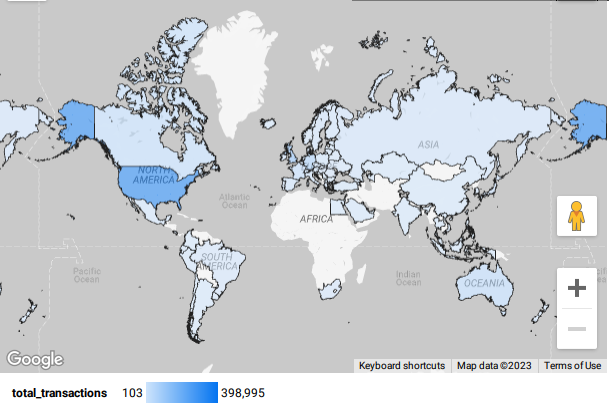
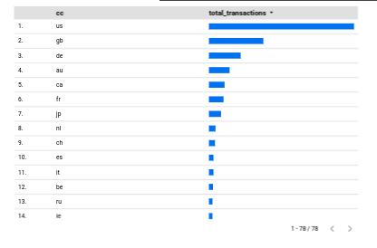

# DataTalksClub - Data Engineering Project


## Bandcamp Sales
This project is based on the 1 million Bandcamp sales dataset.


### Goals
Goals of the project are to find:
- The total sales in each country.
- The highest selling artist in each country.
- Highest average `amount_paid_usd` per sale by artist in each country.


### Answers
This project will answer the following questions:
* Which country spends the most on average where POS activity greater than 20?
    - Will use a table based off of sales_partitioned
* Which artist has the most sales in each country?
    - Will use a table based off of sales_clustered
* Which artist receives the highest USD in average POS by country.
    - Will use a table based off of sales_clustered



            - Main Dataset table after PySpark Transformations.
        * columns:
            - name: intId
                * A float number cut from _id.
            - name: _id
                * A long reference - the Artist name and extra identification.
                    - This column was split and the number format at the beginning was copied and used as the 'intId'.
            - name: datetime
                * IGNORE
            - name: country_code
                * Two letter country code
            - name: ST
                * IGNORE
            - name: IT
                * IGNORE
            - name: item_price
                * IGNORE
            - name: amount_paid_usd
                * Amount paid by the customer
            - name: art_id
                * IGNORE
            - name: releases
                * IGNORE
            - name: artist_name
                * Artist name we use for our data ingestion.
            - name: album_title
                * IGNORE
            - name: cc_ref
                * An iterative number given to the list of countries.
                    - We first take Distinct countries from the Dataset and then create a suparate table - country_code_ref as a lookup table.
                    - This `cc_ref` is used as `RANGE_BUCKET` so that we can partition based off of distinct country.

    - name: country_code_ref
        * description: >
            - A Reference for the RANGE_BUCKET id (cc_ref) as a lookup for country_code.
        * columns:
            - name: count
                * The total count of sales in country.
            - name: contry_code
                * Two letter country code.
            - name: cc_ref
                * The country iterative id used for RANGE_BUCKET purposes.


### Spark as a Data Transformation
PySpark is used for transforming data.
1) We will take the Bandcamp Dataset.
2) Find all distinct countries.
3) Add an iterative number to each country (cc_ref)
4) Drop some unnecessary columns from original dataset.
5) Send back to Google Cloud Storage.

#### PySpark used above may have been unnecessary here for this small dataset but used for learning purposes.

---

## Reproduce The Project
1. Create identity key:
In your local machine do the following (OR SKIP THIS AND USE A KEY YOU ALREADY HAVE IF YOU PREFER)
```
$ ssh-keygen
```
- WHEN ASKED THE FOLLWING QUESTION:
    * `Enter file in which to save the key (/home/<USER>/.ssh/id_rsa):`
- ANSWER WITH:
    * `/home/<USER>/.ssh/dtc_rsa`

2. In Google Cloud, go to 'META'
    - May need to search for meta (or ssh keys)
    - Add your ssh public key (~/.ssh/dtc_rsa.pub) to the metadata page
        * IMPORTANT: Make sure the key name you upload ends in '.pub'

3. Create a Google Cloud Instance
    - Search for instances and go to the VM Instance page.
    - Click Create An Instance
    - Select your region and keep note of the region name (ignoring the content inside the paranthesis)
    - Under machine Series, select: E2
    - Under machine Type, select: e2-standard-2 (OR e2-medium)
        * This gives 8 GB memory (or 4 GB)
    - Under Boot Disk:
        * Operating System: Ubuntu
        * Version: 22.04 LTS (x86/64)
        * Boot Disk Type: SSD Persistent Disk
        * Size: 30 GB
        * click 'SELECT'
    - Under 'Identity and API Access':
        * Select your service account email best used for GCS and BigQuery operation.
    - click 'CREATE'
    - Verify your instance was created.
    - Copy the external IP Address shown on the next page after the Instance is created.
        * You may have to click 'View Network Details' in the 3-dot menu to see the IP Address.

4. Copy the IP Address from your google cloud instance to your `~/.ssh/config` like so:
```bash
Host dtc
  Hostname X.X.X.X
  User <REMOTE-USERNAME>
  IdentityFile /home/<LAPTOP/COMPUTER USERNAME>/.ssh/dtc
  SetEnv TERM=xterm-256color
```
  - Ignore the above if you do not have Linux or Mac.
  - Replace X.X.X.X with the IP Address given for your Remote Google Cloud Instance

5. SSH into your Google Cloud Instance:
```
$ ssh dtc
```
  - OR:
```
$ ssh <REMOTE-USERNAME>@X.X.X.X
```

6. Then in the remote Google Cloud Instance execute the following commands:
```bash
$ git clone https://github.com/jrhamilton/bcsales
$ source bcsales/vm/SourceMe.sh
```

7. Add your REMOTE INSTANCE key to Google Cloud that was made during the interactive prompts.
    - Just like you did with your local key earlier (If you followed that process)
    - In Google Cloud Console, search for 'metadata' or 'ssh keys'.
    - Add the key from your remote instance to the ssh key page.
    - `cat ~/.ssh/id_ed25519.pub`
    - Add the contents from the `cat` to the ssh key page.

8. Now add your GOOGLE_APPLICATION_CREDENTIALS to your REMOTE machine.
    - Add the credentials to `$HOME/.creds/gcp/gac.json`
    - I like to use scp. From your local machine execute the following:
        `$ scp ~/<CREDENTIALS_LOCATION> gcp:~/.creds/gcp/gac.json`
    - For example, mine would be:
        `$ scp ~/.google_application_credentials.json gcp:~/.creds/gcp/gac.json`

#### We are done with Virtual Machine setup.


---


## REBOOT
From here, it is best just to reboot the instance and log back in to avoid any Environment issues.
`$ sudo reboot`

- Log back in:
`$ ssh dtc`

---

### Start Tmux
```
$ cd ~/bcsales
$ tmux new -t bc
```
This will start a Tmux session
* type `CTRL-B C`
    - That is the key (CTRL) and the key (b) pressed at the same time, let go, then press the key (c)
    - This will put you in another window.
* Now type `CTRL-B 0`
    - This will take you back to previous window.
    - At any time you can hit the Esc button to 'reset' if you think you messed up the key-combination.
* Now type `CTRL-B 1` to go back the newer window.
    - `$ prefect orion start`
    - If you get an error: 'prefect not found': open another window:
        * `CTRL-B C`
        * Then run the command again: `$ prefect orion start`
* Now type `CTRL-B %`
    - This will create a new pane in same window.
    - This will be for your Prefect Agent.
* `$ prefect agent start -q default`
* Now type `CTRL-B C`
    - This will execute Tmux to put you in a new Window.


### Port Forwarding
If you want to view Prefect UI, you can view the UI locally by executing the following from your Local machine in a separate terminal:
```
ssh -L 4200:127.0.0.1:4200 dtc
```
Now you can go to http://127.0.0.1:4200 to view the UI.
Unfortunately, I had Prefect turned off in my final push to Github before submitting, so most Prefect items will not be used in this project.

---

## Build Program
Back to Remote Instance..
Execute the folowing commands
```
$ cd ~/bcsales/terraform
$ terraform init
$ terraform plan
$ terraform apply
```
- REPLY: 'yes'

Get into a new Tmux window:
`CTRL-B C`

```
$ cd ~/bcsales
$ bash run_program.sh
```

## Run DBT
When the above program (run_program.sh) is done building, execute the folowing commands:
```
$ cd ~/bcsales/dbt/bcsales
$ dbt deps
$ dbt build
$ dbt build -t prod
```

---

You can biuld from Looker Studio
LINKS:
Highest selling artist by country:
https://lookerstudio.google.com/s/t49FPHiCa6E
